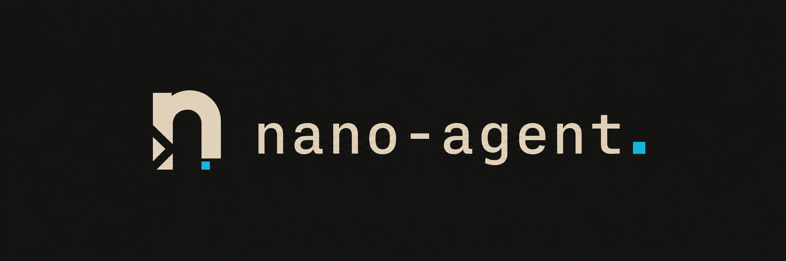
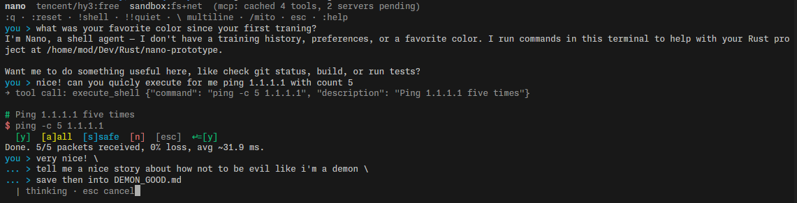
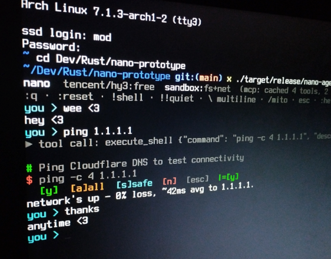
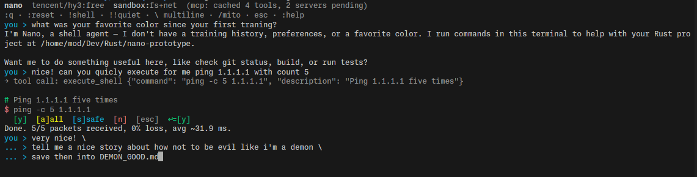
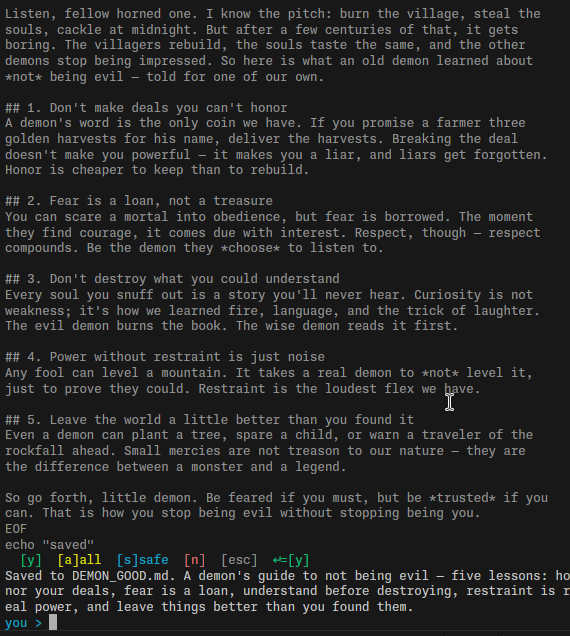

<!-- <p align="center">
  
</p> -->


# nano-agent

A tiny shell agent. Talks to any OpenAI-compatible API, runs commands **you approve**, stays out of the way.

```sh
cargo install --path .
export OPENAI_API_KEY=sk-...
nano-agent "what's in this repo?"
```

No args → REPL. That's the product.

## In action

<p align="center">
  
</p>

<table align="center">
  <tr>
    <td align="center">
      <strong>nano, unplugged</strong><br>
      <sub>straight from <code>tty3</code></sub><br><br>
      
    </td>
  </tr>
</table>

<details>
<summary>More screenshots</summary>
  <p align="center">
    
  </p>   
  <p align="center">
    
  </p>
</details>

## Shape

```
you → model → execute_shell? → you approve → bwrap → output → model → answer
```

No plugin system. No second UI. One tool that matters, plus optional MCP/ACP if you ask for them.

## Usage

```sh
nano-agent "fix the failing test"   # one-shot
nano-agent                          # REPL
nano-agent -c                       # continue last session here
nano-agent -s                       # pick a recent session
nano-agent --no-ctx                 # no Nano/project system context
nano-agent --show-config
nano-agent --voice                   # local Moonshine STT + TTS
nano-agent --help
```

### Voice mode

```sh
pip install moonshine-voice
nano-agent --voice
```

`--voice` listens for a completed phrase, sends it through Nano's usual session/tool-approval flow, prints the reply, then speaks it. Moonshine downloads the English STT/TTS models on first use; the mic is paused while Nano speaks to prevent feedback.

`--no-ctx` omits Nano's own system prompt and skips project doc, skill, and harness discovery. Configuration, explicit session history, and tools still work normally.

Approval for each command:

```
# list rust sources
$ rg --files -t rust  [safe]
  [y]  [a]all  [s]safe  [n]  [esc]
```

| Key | Meaning |
|-----|---------|
| **Enter** | accept the **suggestion** from the risk tag: `[safe]` → `s`, `[write]` → `y`; `[danger]` will **not** run (type `y` explicitly) |
| `y` | run this once |
| `a` | run remaining non-danger commands this turn |
| `s` | run this non-danger command + auto-ok **safe** patterns (`ls`, `git status`, `cargo test`, `cargo fmt --check`, `rg`, …) |
| `n` / Esc | deny / cancel turn |

Non-default `cwd`, `timeout`, and `env` are shown before approval; secret-looking env values are redacted.
Source-editing commands like `cargo fmt`, `rustfmt file`, and `sed -i` are not `[safe]`.
Deletion commands like `rm`, `unlink`, `rmdir`, `git rm`, `find -delete`, `find -exec rm`, and `xargs rm` are `[danger]`, including common `sudo` wrappers.
Data-destroying commands like `dd of=...`, `rsync --delete`, and `shred` are `[danger]`.
Git discard/delete commands like `git restore`, `git checkout --`, `git clean`, `git stash drop`, and `git branch -D` are `[danger]`, including common `sudo` / `git -C` forms.
`[danger]` commands always need explicit `y`; Enter, `a`, and `s` refuse them.

REPL: `›` prompt · `:q` · `:reset` · `:config` · `/mito` · `/self-harness <validator>` · line ending `\` continues.

**Shell shortcuts** (no approval — you typed it):

```
! cat text.md     # run; output printed + noted for the model's next turn
!! cat secret.md  # run; printed only, model never sees it
```

**Cancel:** press **Esc** (or Ctrl+C) while the spinner shows `thinking · esc cancel`, or while a long shell command runs. Approval prompt still uses Esc to cancel the turn.

## Other models

```sh
export OPENAI_BASE_URL=http://localhost:11434/v1   # Ollama
export OPENAI_MODEL=gemma4
# localhost needs no API key
```

All nano state lives under **`~/.nano/`**:

```
~/.nano/
  config.json              # global config
  mcp_cache.json           # MCP tool cache
  sessions/<hash>.jsonl    # sessions for one directory
  trusted-projects/<hash>  # exact project path + remembered shell sandbox
```

Project overlay: `./nano_config.json`. On first interactive use of a new path, Nano explains the risk, asks for trust, then records an explicit `fs`, `fs+net`, or `net-only` shell sandbox for that exact canonical path. Existing path-only trust markers remain valid and default to `fs`. Non-interactive runs ignore untrusted project config. `NANO_TRUST_PROJECT_CONFIG=1` remains an explicit one-run override. See [example_config.json](example_config.json).

Trust markers stay readable while preserving arbitrary path bytes: the first line is `sandbox=<mode>` and everything after its newline is the exact canonical path.

## Env

| Variable | Meaning |
|----------|---------|
| `OPENAI_API_KEY` | required unless provider has a key or endpoint is localhost |
| `OPENAI_BASE_URL` | OpenAI-compatible base → chat-completions |
| `OPENAI_MODEL` | model id |
| `NANO_MAX_STEPS` | tool-loop cap (default 200) |
| `NANO_SANDBOX` | `off` · `fs` (default, no net) · `fs+net` · `net-only` |
| `NANO_TRUST_PROJECT_CONFIG` | `1` to bypass the project-config trust prompt |

An explicit `NANO_SANDBOX` value overrides the remembered project choice for that run.

If a command fails with a network-looking error under the default sandbox, nano prints a `NANO_SANDBOX=fs+net` hint.

`net-only` applies to shell subprocesses: it enables network, hides project/home files, exposes only minimal runtime/DNS/TLS files, uses disposable scratch space, and drops inherited API/cloud credential variables. Nano's API connection and configured MCP servers are separate from this shell sandbox.

## Optional extras

- **MCP** — `mcp_servers` in config; set an entry's `"enabled": false` to keep it without connecting
- **mito** — `/mito` local planner (needs `mito-mode` + chat-completions provider)
- **self-harness** — `/self-harness cargo test` proposes `.nano/harness.md` if validator passes
- **ACP** — `--features acp` → `nano-agent --acp` and child agents under `acp_agents`; disabled entries are not offered or spawned
  - ACP shell calls refuse `[danger]` commands by default; set `NANO_ACP_ALLOW_DANGER=1` in that agent's env to allow them.

## Design (why this, not AutoGPT)

1. **Trust boundary is the human.** Every shell line is visible; risk-tagged (`safe` / `write` / `danger`).
2. **One primary tool.** Multi-tool dragons hide failure modes.
3. **Short system prompt.** Procedures the model can follow, not a novel.
4. **Preserve user work.** Before edits/deletes in a git repo, Nano is told to inspect status and avoid clobbering.
5. **Project config is untrusted by default.** A cloned repo cannot launch MCP commands or redirect API credentials unless you opt in.
6. **Session resume that fails loud.** Format mismatch → start fresh, don't half-context.
7. **Sandbox with a name.** `fs`, `fs+net`, `net-only`, or `off` — isolation is a policy, not a mystery.

## Arch

```sh
yay -S nano-agent
```
